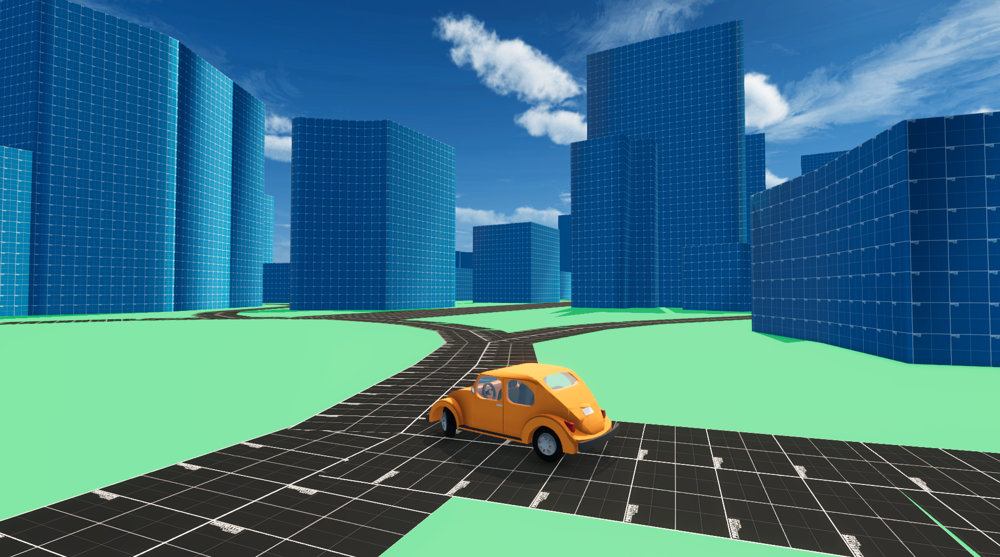
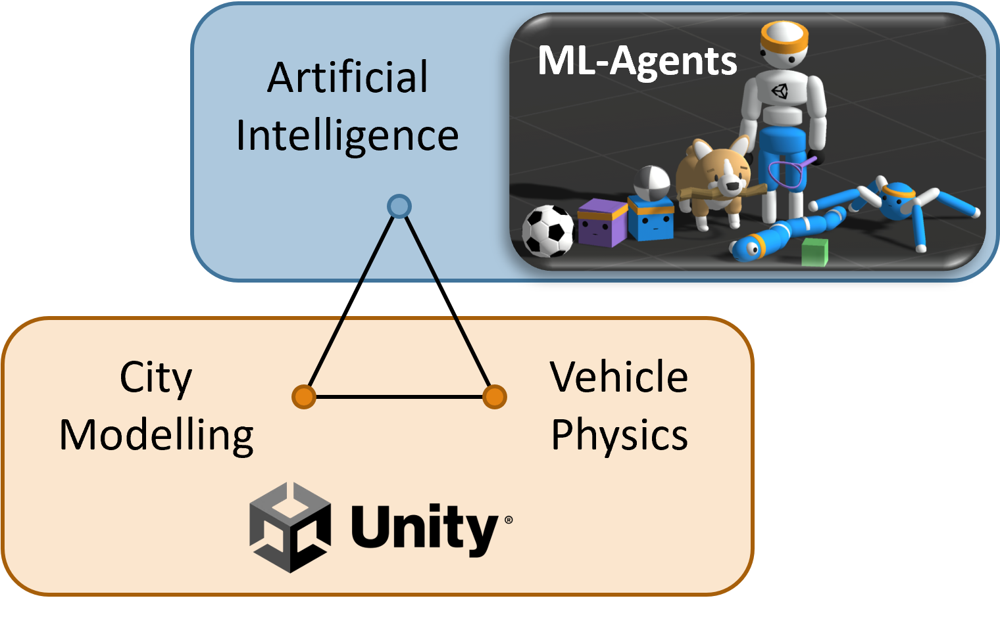
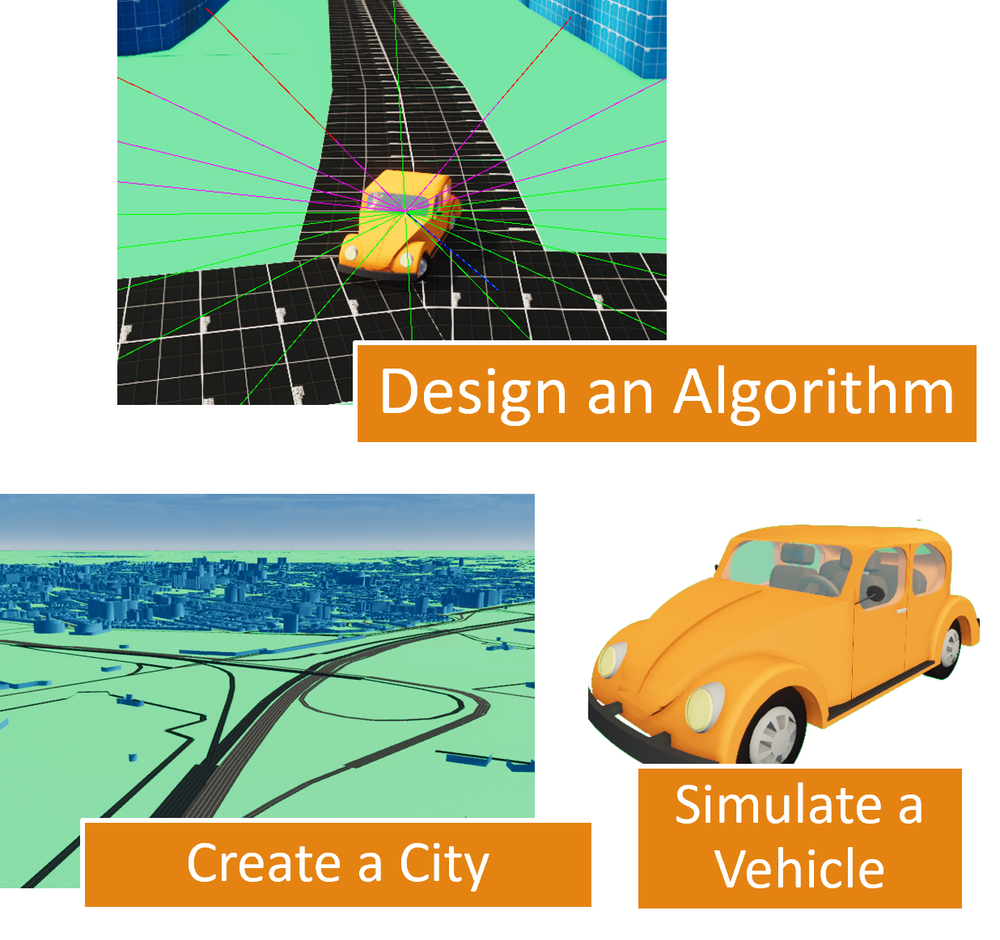

# Urban Autonomous Vehicle Simulation Demonstration

  

## Overview

This page presents a project I have worked on from February 2022 to June 2023. Its goal is to determine, through experimentation, necessary characteristics for an autonomous vehicle algorithm model using deep reinforcement learning, to study the relevance of its training in a virtual urban simulation, and to demonstrate the effectiveness of this algorithm by measuring the degree of complexity to which its response is satisfactory.

This project consists in several components, an urban simulation and a vehicle physics simulation created using [Unity](https://unity.com), as well as an AI algorithm developed with the [ML-Agents toolkit](https://github.com/Unity-Technologies/ml-agents).

Here is the roadmap of the project:

- Develop a virtual vehicle with a realistic appearance and behavior by designing its 3D model and simulating its mechanical components and physics in Unity.
- Create an AI algorithm using ML-Agents for this vehicle, aimed at refining its parameters through behavior analysis in progressively complex environments until it can proficiently navigate a virtual urban setting.
- Design a program to generate a realistic urban environment using the free cartographic database [OpenStreetMap](https://www.openstreetmap.org).

The methodologies and tools employed in this project are the result of a bibliographical study available [here](#bibliography--project-justification).

See [Results and Conclusion](#results-and-conclusion) for a drive through the city with the AI.

## Table of Contents

- [Overview](#overview)
- [Table of Contents](#table-of-contents)
- [Project Motivation](#project-motivation)
- [Project Presentation & Current State](#project-presentation--current-state)
  - [Introduction](#introduction)
    - [Goals of the Simulation](#goals-of-the-simulation)
    - [Basic Features](#basic-features)
  - [Vehicle Simulation](#vehicle-simulation)
    - [The Chassis](#the-chassis)
    - [The Mechanical Aspects](#the-mechanical-aspects)
  - [City Modeling](#city-modeling)
    - [Operating Principle](#operating-principle)
    - [A\* Search Algorithm](#a-search-algorithm)
  - [Autonomous Vehicle Algorithm](#autonomous-vehicle-algorithm)
    - [Operating Principle (Deep Reinforcement Learning)](#operating-principle-deep-reinforcement-learning)
    - [First Training Environment](#first-training-environment)
    - [Second Training Environment](#second-training-environment)
    - [Training in the City](#training-in-the-city)
  - [Results and Conclusion](#results-and-conclusion)
- [Work Timeline](#work-timeline)
- [Bibliography & Project Justification](#bibliography--project-justification)
  - [Annotated Bibliography](#annotated-bibliography)
  - [References](#references)
  
## Project Motivation

Autonomous vehicles engage multiple apsects of artificial intelligence. Their simulation in an urban setting requires a computational approach involving the use of a physical and graphical engine to simulate vehicle operations, and mathematical algorithms to generate an urban environment. The components of this interdisciplinary project have captivated my interest.

The transport network is essential in a city as it provides its structure. However, it currently faces numerous challenges such as pollution, safety, and traffic congestion. Therefore, due to the potential improvements it promises, the integration of autonomous vehicles into urban traffic is poised to become a transformative development for the cities of the future.

## Project Presentation & Current State

### Introduction

#### Goals of the Simulation

This project is based on three main pillars that will serve as the plan for this presentation.

  

The project begins with designing a realistic physics model for a vehicle, followed by modeling an urban environment. This necessitates the use of a graphic and physical engine capable of simulating physics in a three-dimensional space and displaying this environment on a screen. I have selected Unity for this purpose, a platform that allows development in C# and is renowned for the creative freedom it offers. Notably, BMW has used Unity to train its autonomous vehicles over 240 million virtual kilometers [[3]](#ref3).

The next step involves designing an artificial intelligence model that can navigate a vehicle through the city. For this, I have chosen to implement the AI using Unity's ML-Agents module.

The objectives thus stem from these three pillars.

  

#### Basic Features

Unity includes a camera feature that facilitates the observation of the environment. The next step was to enable camera mobility. To achieve this, I designed two types of cameras:

- A pivot camera, which is attached to the car and can rotate around it in a manner similar to a cinema crane, using two pivot points.
- A free camera, which can move independently like a drone or helicopter, offering extensive versatility in viewing angles.

Additionally, it was necessary to develop an options menu. This menu allows users to adjust the simulation settings according to the computing power of the device on which the simulation is running.

  

### Vehicle Simulation

#### The Chassis

The simulation of the chassis is based on two points.

Firstly, it incorporates the Ackermann-Jeantaud steering system, which ensures that the two steering wheels align on two concentric circles, thereby applying the same steering force to the vehicle. The system operates by conceptualizing an imaginary wheel at the vehicle's center, which is controlled by the steering wheel. From this central point, the angles of the other two wheels are calculated to maintain the correct trajectory and steering dynamics.

  

Next, I also developed a simulation for the wheels that includes a ground detection point. This point is calculated by firing a detection ray from the center of the wheel toward the ground. This technique helps determine the distance between the ground and the wheel, allowing for the accurate simulation of the shock absorber’s force as it responds to varying terrain. Subsequently, a collision box is also added around the wheel.

  

#### The Mechanical Aspects

This rear-wheel drive car is modeled using four main components: the engine, the transmission, the differential, and the driving wheels.

  

The transmission and the differential are conceptualized as a system of two gears. The gear ratio, denoted as *r*, is calculated between the output and input gears to establish how the power and torque are transmitted through these components.

The engine simulation is based on a cyclical process. By tracing back through the transmission, the engine's rotation speed can be determined by averaging the rotation speeds of the driving wheels.

Once the engine's rotation speed is known, the force exerted by the engine is determined from the torque curve provided by the vehicle's manufacturer. This force is then traced back down through the transmission in a similar fashion. Ultimately, half of the calculated force is applied to each of the driving wheels.

  

  

  

After simulating the engine, it is also necessary to simulate the gearbox. This gearbox is represented as a list of selectable gear ratios that adjust the transmission ratio accordingly.

To facilitate the operation of the AI algorithm, the gearbox is designed to function automatically. The primary goal is to maximize the engine’s power output. Therefore, the gearbox is programmed to automatically shift up when the power output exceeds a predetermined maximum.

  

### City Modeling

  

#### Operating Principle

After exploring various options, I ultimately decided to use a real city database to train the algorithm under optimal conditions.

I chose the free cartographic database [OpenStreetMap](https://www.openstreetmap.org), which provides three main types of elements: points, which are specific coordinates; roads, which are defined as non-cyclic successions of points, effectively mapping out the transportation network; and buildings, which are represented as cyclic successions of points, outlining their perimeters.

  

The next step involves triangulating the map elements. Triangulation is necessary because computers, and particularly graphics cards, interpret visual data primarily as triangles.

Simpler geometric shapes, like roads or walls, which are essentially rectangles, are relatively straightforward to triangulate. However, more complex structures, such as tunnels or building roofs, require a sophisticated approach due to their irregular shapes.

To handle these complex cases, I opted to implement [Seidel's algorithm](#ref10), a triangulation method developed in 1991. This algorithm decomposes polygons into trapezoid, even for polygons with multiple holes and intricate outlines. Below, I have illustrated how a polygon is represented and provided examples of polygons that have been triangulated using Seidel's algorithm.

  

  

#### A* Search Algorithm

To enable the algorithm to efficiently navigate through the city using roads, I incorporated the A* search algorithm, a widely used graph traversal method that is particularly effective for pathfinding on weighted graphs.

The A* algorithm operates using a heuristic to determine the most promising path to follow. The heuristic is calculated for each node and consists of the sum of two distances: the distance from the node to the starting point *A*, and the estimated distance from the node to the destination point *B*.

Here's an example illustrating this concept using actual city data, with numerical values representing the two distances and the calculated heuritic cost.

  

The core principle of the A* algorithm is to examine the neighbors of the currently considered point and to continue the search from the point that has the lowest heuristic cost.

This method of selectively exploring nodes significantly reduces the number of points that need to be examined. When applied to the scale of an entire city, this can save a considerable amount of computational time and resources.

### Autonomous Vehicle Algorithm

#### Operating Principle (Deep Reinforcement Learning)

In the realm of AI algorithms, there are several major categories, each suited to different types of problems and data. One major category includes algorithms like Recurrent Neural Networks (RNNs), which are used primarily for tasks that involve learning from sequential data, such as text generation or speech recognition. These algorithms learn to recognize and reproduce patterns based on extensive datasets. Another significant category is Reinforcement Learning (RL), where algorithms learn to make a sequence of decisions by interacting with an environment and receiving feedback in the form of a reward function.

For this project, I selected the second group, specifically opting for a deep reinforcement learning algorithm. The rationale behind this choice is that there isn't an existing database of vehicles navigating through city environments. Furthermore, the scenarios a vehicle might encounter in real-world urban driving are highly variable and unpredictable, requiring an algorithm that can dynamically adapt to new situations it has never encountered before.

Here is the operating principle of a deep reinforcement learning algorithm (the color code will be retained for further explanations).

  

The deep reinforcement learning algorithm operates in three stages:

- **Observations**: These are values representing the learning environment, which the algorithm uses to make informed decisions. Observations typically come in the form of vectors and, based on experience, it is better to express these in the vehicle’s reference frame. This alignment helps the algorithm better understand and react to its surroundings from the perspective of the vehicle itself.
- **Actions**: These are the maneuvers that the algorithm performs to interact with and explore its environment. Actions could include turning, accelerating, or braking, each chosen based on the algorithm's current understanding of the environment to effectively navigate and achieve specific objectives.
- **Rewards**: This is a scoring system that evaluates each action taken by the algorithm. Rewards are crucial as they provide immediate feedback to the algorithm, indicating whether an action has moved it closer to or further from its goal. The fundamental aim of the algorithm is to maximize these rewards.

The goal of this process is to progressively train the algorithm in environments of increasing complexity until it succeeds in navigating through the city.

#### First Training Environment

  

  

The initial training environment for the deep reinforcement learning algorithm is designed to teach basic vehicle control. In this setup, the vehicle is positioned on a finite, flat platform with a simple goal: to head towards an arrow placed in the environment. This foundational setup helps the algorithm grasp the basic mechanics of vehicle movement and steering.

The following observations are provided to the algorithm: the direction towards the arrow and the speed of the vehicle.

Initially, the algorithm's reward strategy was straightforward: it received higher rewards the closer it got to the arrow. However, this approach led to a significant issue. Indeed, the algorithm often encountered the following situation: if the vehicle moved forward or backward, it moves away from the arrow due to insufficient turning radius, and thus the algorithm prematurely concludes it had reached a local maximum in the reward function, stalling further progress.

To address this, I modified the reward function to focus not just on proximity but on the vehicle's orientation relative to the arrow. This was implemented using a dot product between the vehicle's heading and the direction to the arrow, rewarding the vehicle more when it faces directly towards the arrow. This reward is further weighted by the vehicle’s speed: the faster the vehicle moves in the correct direction, the higher the reward. This method proved successful.

  

#### Second Training Environment

  

In the second training environment, the focus shifts to teaching the algorithm how to effectively avoid obstacles.

Therefore, detection rays are added to the vehicle's sensory array. These rays function as proximity sensors, detecting obstacles around the vehicle.

The reward system is adjusted to discourage the vehicle from getting too close to obstacles.

To further refine the vehicle's behavior, the reward is now also weighted by the base-2 logarithm of the distance between the car and the arrow. This weighting reflects the dual objectives of the training: maintaining proximity to the target while prioritizing slower, more controlled movements. The closer the vehicle is to the arrow, the greater the reward, emphasizing that the goal in an urban setting is not just speed but also precision and safety.

  

#### Training in the City

Now that the algorithm has been trained in both vehicle control and obstacle avoidance, it is ready to start training in the city.

  

I have noticed three cases where it does not behave as expected.

First, the car tends to drive on the right side to reach the destination arrow, likely as a strategy to avoid any potential obstacles, such as a wall, immediately after the arrow. This behavior indicates that while the algorithm is effectively avoiding obstacles, it may be over-prioritizing this avoidance in certain scenarios, leading to suboptimal path choices.

  

Next, the lack of specific data about bridges means the algorithm does not recognize them. Consequently, it searches for the arrow underneath these structures. This behavior highlights a gap in the data provided to the algorithm, which if filled, could significantly enhance its navigation accuracy.

  

The algorithm prefers to circumvent buildings entirely, rather than passing closely by them, suggesting it is applying its obstacle avoidance training effectively. However, this also means it might choose longer or less direct paths if these are perceived as safer or clearer.

This behavior is not necessarily foolish; in fact, it's quite clever given that the algorithm is not specifically instructed to follow the roads. This highlights a clear path for further improvement.

  

The algorithm sometimes encounters complex situations where it chooses to stop moving rather than risk colliding with an obstacle.

### Results and Conclusion

  

Several short-term improvements are possible:

- Introducing additional targets to improve anticipation.
- Adjusting the sensitivity of the sensors, as the algorithm tends to be overly cautious.
- Encouraging the algorithm to follow roads.
- Allowing more time for the algorithm to train and adapt.

Long-term enhancements could include:

- Introducing multiple vehicles to navigate the city simultaneously.
- Increasing the complexity of the urban environment with crosswalks, traffic lights, pedestrians, and other elements.

  

## Work Timeline

- **February 2022**: 3D modeling of a car and a bus in Tinkercad to create different types of vehicles suitable for Unity. Development of the pivot camera and the first vehicle physics capable of simulating shock absorbers, steering, traction, and torque application to the wheels.
  
  

  
  

- **March 2022**: Design and training of the first AI algorithm with ML-Agents aimed at controlling the vehicle to reach a point on a flat surface. Identification of the algorithm’s flaws and improvement of its reward function and observations.
  
  

- **Early April 2022**: Development of a system that allows multiple vehicles on different computers to interact in the same environment using Photon Engine (a host enabling packet transfer from Unity to a server), a feature that was ultimately unused.
  
  

- **April, May, June 2022**: Attempts to model the city, initially using Google Earth and RenderDoc, then using OpenStreetMap with the Python module pyrosm and Blender, and finally directly in Unity using OpenStreetMap through the OsmSharp module.
  
  

- **December 2022**: Implementation of a free camera and simulation of the vehicle engine based on its torque as a function of its revolutions per minute (using Bézier curves to approximate the data). Development of the manual or automatic gearbox and the Ackermann-Jeantaud steering system.
  
  

- **January 2023**: Design and training of the second AI algorithm, now capable of observing its environment using obstacle detection rays to avoid them.
  
  

- **February, resumed mid-May 2023**: Modeling of the city using OpenStreetMap data in XML format and representing it with a data structure suitable for Unity. Triangulation of this data (notably with Seidel's algorithm) to transform it into 3D models.
  
  

- **Late May, early June 2023**: Design and training of the AI algorithm with the goal of operating in an urban environment. Implementation of the A* algorithm for fast pathfinding between two points in the city, providing the AI algorithm with the steps of its route.

## Bibliography & Project Justification

### Annotated Bibliography

Numerous studies on the implementation of autonomous vehicles in urban settings have been conducted by the scientific community since the 1980s. For instance, a pioneering experiment conducted in 1986 demonstrated the use of camera-based recognition [[1]](#ref1) and three-dimensional mapping using sonar and laser rangefinders to enable a vehicle to follow a road, particularly one with road markings. Although innovative, this experiment highlighted the limitations of deterministic algorithms, which, given a particular input, will always produce the same output. Indeed, like all prototypes of that era, this vehicle operated on a test track under conditions too specific for widespread use. Consequently, heuristic methods have also been explored as they allow for the rapid resolution of complex optimization problems without requiring formal modeling. However, they rely on a precise empirical study of the problem and do not always provide the optimal solution. Artificial intelligence algorithms are therefore predominantly used in the field of autonomous vehicles because they are capable of autonomously discovering the rules that govern their environments, understanding which is essential for effectively solving the problem.

It is conceivable to use a control center that would communicate the necessary information to each vehicle. However, this system can fail or be maliciously tampered with; therefore, a local implementation would be preferable, so that each vehicle is equipped with its own algorithm. For instance, a solution aimed at minimizing the centralization of the infrastructure was employed to manage traffic at an intersection [[2]](#ref2).

In order to train an algorithm, it is essential to collect a substantial amount of data to enable it to gain a satisfactory understanding of its environment. In the case of autonomous vehicles, this data can be gathered in reality with sensor-equipped vehicles or through a simulation of an urban environment in which the vehicles operate directly. The latter solution is more widely used because a simulation is always available, almost fully customizable, and allows for the training of algorithms in less time, under more varied conditions, at lower cost, and without risk. This is why the automotive manufacturer BMW has chosen Unity as the training environment for its autonomous vehicle algorithms [[3]](#ref3).

Indeed, the Unity graphics and physics engine allows for the creation of three-dimensional virtual environments and the simulation of realistic physics within them. It has been widely adopted by numerous industries such as video games, cinema, automotive, architecture, engineering, and construction. One of the main reasons for its popularity is its quality as a general platform equipped with flexible tools that facilitate a wide range of projects, from photorealistic animated films to simulations of autonomous military drones. Unity provides the capability to design various artificial intelligence algorithms, notably through the ML-Agents Toolkit extension [[4]](#ref4). For example, the Udacity autonomous car simulator was created using Unity and allows for the training of convolutional neural networks to drive a vehicle through supervised learning [[5]](#ref5) [[6]](#ref6). Unity also supports deep reinforcement learning, which is an effective method for training an algorithm as it allows for significant autonomy and explores extreme cases; this type of learning has been used to train a vehicle to follow road markings [[7]](#ref7). Furthermore, an algorithm has been trained to navigate mountain roads using the different deep reinforcement learning modes available in the ML-Agents library [[8]](#ref8); Proximal Policy Optimization (PPO) has been identified as the most effective. This method is easier to use, more general, and often finds solutions faster than other algorithms in the same family [[9]](#ref9). Therefore, it is pertinent to use Unity to simulate an urban environment consisting of vehicles controlled by PPO algorithms through the ML-Agents library.

### References

- [1] TAKEO KANADE, CHUCK THORPE AND WILLIAM WHITTAKER : Autonomous Land Vehicle Project at CMU : <https://dl.acm.org/doi/pdf/10.1145/324634.325197>
- [2] KURT DRESNER AND PETER STONE : Multiagent Traffic Management: A Reservation-Based Intersection Control Mechanism : <https://www.cs.utexas.edu/~pstone/Papers/bib2htmllinks/AAMAS04.pdf>
- [3] DAN CARNEY : BMW Uses Unity 3D to Create Virtual World for Autonomous Driving Development : <https://www.designnews.com/automotive-engineering/bmw-uses-unity-3d-createvirtual-world-autonomous-driving-development>
- [4] A. JULIANI, V.-P. BERGES, E. TENG, A. COHEN, J. HARPER, C. ELION, C. GOY, Y.GAO, H. HENRY, M. MATTAR AND D. LANGE : Unity: A General Platform for Intelligent Agents : <https://arxiv.org/pdf/1809.02627.pdf>
- [5] SHRADDHA MANCHEKAR, BHARGAV PARSI, NIKHIL THAKUR AND KELLY BIELASKI : Simulation of Self Driving Car : <https://bhargav265.github.io/Simulation_of_self_driving_car/ArtificialLifeReport.pdf>
- [6] GREG KATZ, ABHISHEK ROUSHAN AND ABHIJEET SHENOI : Supervised Learning for Autonomous Driving : <http://cs229.stanford.edu/proj2017/final-reports/5243612.pdf>
- [7] QI ZHANG, TAO DU AND CHANGZHENG TIAN : Self-driving scale car trained by Deep reinforcement Learning : <https://arxiv.org/ftp/arxiv/papers/1909/1909.03467.pdf>
- [8] XIAOHU LI, ZEHONG CAO AND QUAN BAI : A Novel Mountain Driving Unity Simulated Environment for Autonomous Vehicles : <https://www.aaai.org/AAAI21Papers/DEMO-265.LiX.pdf>
- [9] JOHN SCHULMAN, FILIP WOLSKI, PRAFULLA DHARIWAL, ALEC RADFORD AND OLEG KLIMOV : Proximal Policy Optimization Algorithms : <https://arxiv.org/pdf/1707.06347.pdf>
- [10] RAIMUND SEIDEL : A simple and fast incremental randomized algorithm for computing trapezoidal decompositions and for triangulating polygons : <https://doi.org/10.1016/0925-7721(91)90012-4>
