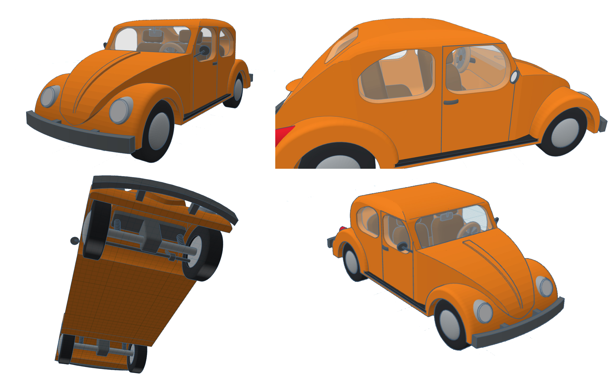
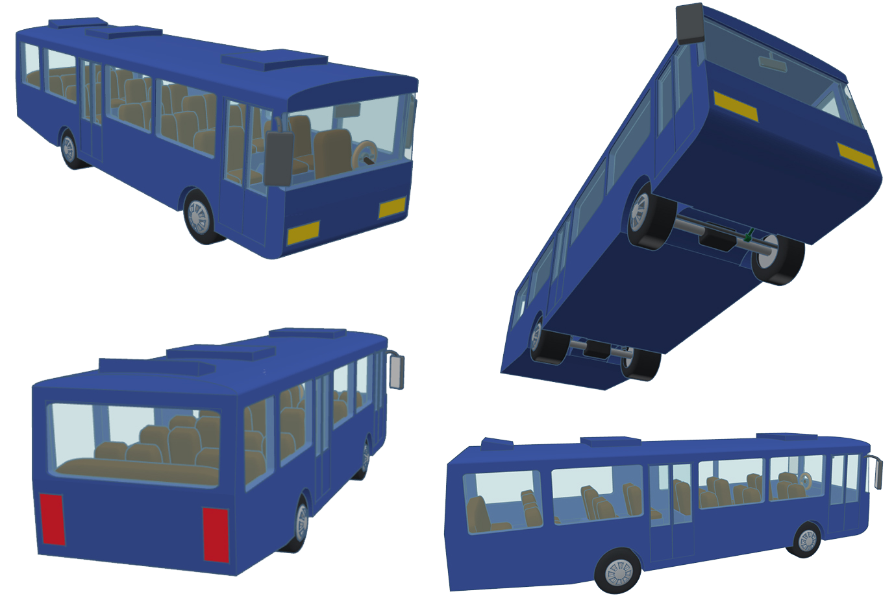

# Urban Autonomous Vehicle Simulation Demonstration

## Overview

This page is dedicated to presenting a project I have worked on from February 2022 to June 2023. Its goal is to determine, through experimentation, the necessary characteristics for an autonomous vehicle algorithm model using deep reinforcement learning, to study the relevance of its training in a virtual urban simulation, and to demonstrate the effectiveness of this algorithm by measuring the degree of complexity to which its response is satisfactory.

This project consists in multiple parts, an urban simulation and a vehicle physics simulation made with [Unity](https://unity.com) and and an AI algorithm based on the [ML-Agents toolkit](https://github.com/Unity-Technologies/ml-agents).

Here is the roadmap of the project:

- Develop a virtual vehicle with a realistic appearance and behavior by designing its 3D model and simulating its mechanical parts and physics in Unity.
- Create an artificial intelligence algorithm using ML-Agents for this vehicle. The aim will be to update its parameters through the study of its behavior in environments of increasing complexity until it can navigate in a virtual urban environment.
- Design a program capable of generating a realistic urban environment using the free cartographic database [OpenStreetMap](https://www.openstreetmap.org).

The different tools used and the directions taken by this project are the result of a study on the subject which you can find [here](#bibliography--project-justification).

## Table of Contents

## Project Motivation

Autonomous vehicles engage multiple facets of artificial intelligence. Their simulation in an urban setting requires a computational approach involving the use of a physical and graphical engine to simulate vehicle operations, and mathematical algorithms to generate an urban environment. The components of this interdisciplinary project have captivated my interest.

The transport network is essential in a city as it provides its structure. However, it currently faces numerous challenges such as pollution, safety, and traffic congestion. Therefore, due to the potential improvements it promises, the integration of autonomous vehicles into urban traffic is poised to become a transformative development for the cities of the future.

## Project Presentation & Current State

### Introduction

#### Goals of the Simulation

This project is based on three main pillars that will serve as the plan for this Presentation.

  

Initially, it involves designing a realistic physics model for a vehicle and, secondly, modeling a city. For this, it is necessary to use a graphic and physical engine that can simulate simple physics in a three-dimensional environment and allow us to observe this environment on a screen. I have chosen to use Unity, an engine where development is done in C# and which is renowned in the field for the creative freedom it offers. BMW has even used it to train its autonomous vehicles to travel over 240 million virtual kilometers [[3]](#ref3).

Thirdly, the task is to design an artificial intelligence model capable of navigating a vehicle through the city. I have chosen to implement this in Unity using the ML-Agents module.

The objectives thus stem from these three pillars.

  

#### Basic Features

Unity provides a camera that enables observation of the environment. What remains is to allow it to move. For this purpose, I have designed two types of cameras:

- A pivot camera, which is attached to the car and can rotate around it like a cinema crane using two pivots.
- And then a free camera, which can move freely like a drone or a helicopter.

It was also necessary to develop an options menu to adapt to the computing power of the computer on which the simulation is run.

  

### Vehicle Simulation

#### The Chassis

The simulation of the chassis is based on two points.

Firstly, it utilises the Ackermann-Jeantaud steering system that allows the two steering wheels to be inscribed on two concentric circles, thereby applying the same steering force to the vehicle. For this, we consider an imaginary wheel at the center of the vehicle that is controlled by the steering wheel, and then calculate the angle of the other two wheels relative to this central wheel.

  

Next, I also simulated the wheels using a ground detection point, which is calculated by firing a detection ray from the center of the wheel towards the ground. This allows for determining the distance between the ground and the wheel and thus simulating the force of the shock absorber. Subsequently, a collision box needs to be added around the wheel, which Unity enables one to do.

  

#### The Mechanical Aspects

This car, which is rear-wheel drive, is modeled as a set of four components: the engine, the transmission, the differential, and the driving wheels.

  

First, we model the transmission and the differential as systems of two gears, for which we calculate the gear ratio between the output and input gears, denoted as r.

The engine simulation is based on a cycle. In fact, by tracing back through the transmission, the engine's rotation speed can be determined by averaging the rotation speed of the driving wheels, since this car is rear-wheel drive.

From this engine rotation speed, we read the force applied by the engine on the torque curve provided by the vehicle's manufacturer. It is then necessary to trace back down the transmission following the same principle and apply half of the calculated force to each of the two wheels.

  

  

     

After simulating the engine, it is also necessary to simulate the gearbox. This gearbox is modeled as a list of gear ratios that can be selected, which change the transmission ratio accordingly.

This gearbox must be able to operate automatically to facilitate the task of the artificial intelligence algorithm. To achieve this, the aim is to maximize the power provided by the engine, and thus shift up when the maximum power is exceeded using this formula.

### City Modeling

  

#### Operating Principle

After numerous attempts, I ultimately decided to use a real city database to train the algorithm under the best possible conditions.

I opted for the free cartographic database [OpenStreetMap](https://www.openstreetmap.org), which provides us with three types of elements: points (coordinates), roads (non-cyclic successions of points), and buildings (cyclic successions of points).

        

The next step involves triangulating these elements since, obviously, the computer and especially the graphics card, only understands triangles.

Some elements are simple to triangulate, such as roads or walls, which are represented by rectangles.

For more complex cases, such as tunnels or building roofs, a triangulation algorithm is required. I chose to implement [Seidel's algorithm](#ref10) from 1991.

Here is how a polygon is represented and some examples of triangulated polygons with this algorithm.

  

        

#### A* Search Algorithm

To enable the algorithm to navigate through the city, it is necessary to be able to traverse the city using roads. For this, I utilized the A* search algorithm, which is a graph traversal algorithm.

This algorithm works with a heuristic calculated as follows: for each considered point, the sum of the distance from this point to the starting point A and the distance from this point to the destination point B is computed.

Here is an example directly taken from the city, with numbers representing distances and, for each point considered by the algorithm, the calculation of the heuristic cost.

  

The principle involves examining the neighbors of the considered point and continuing with the point that has the lowest heuristic cost.

In this way, the study of many points is avoided, which, on the scale of a city, saves a significant amount of time.

### Autonomous Vehicle Algorithm

#### Operating Principle (Deep Reinforcement Learning)

There are two groups of algorithms: those that learn to reproduce a database, like recurrent neural networks for text, and those that independently explore an environment using a reward function.

I have chosen to use this second group of algorithms, specifically a deep reinforcement learning algorithm, because there is no database of vehicles driving in a city and the algorithm must be able to adapt to situations it has never encountered before.

Here is the operating principle of such an algorithm (the color code will be retained for further explanations).

  

The deep reinforcement learning algorithm operates in three stages:

- Observations, in the form of values representing the learning environment, which the algorithm can use to solve the problem it faces. When these values are vectors, it is strongly advised, through experience, that they be expressed in the vehicle’s reference frame.
- Actions that correspond to acts performed by the algorithm to explore its environment and solve the problem.
- Rewards, which is a kind of score given to each action of the algorithm to let it know whether what it is doing is good or not. This part is very important as it ensures that the algorithm does what we want. This stage also helps to understand the workings of such an algorithm: its goal is to maximize this reward.

The goal is to train the algorithm in increasingly complex environments until it succeeds in navigating through the city.

#### First Training Environment

The purpose of the first training environment is to teach the algorithm to control the vehicle. The vehicle is thus placed on a finite, flat platform, and its goal is to head towards an arrow.

The following observations are provided to the algorithm: the direction towards the arrow and the speed of the vehicle.

In my first attempt, the algorithm was rewarded the closer it was to the arrow. However, it often encountered this situation: if the vehicle moves forward, it moves away from the arrow, and the same happens if it moves backward, and its turning radius is not tight enough to head towards the arrow without first moving away from it. It then considers that it has reached a local maximum of the reward function and stops evolving.

I then opted to reward it the more it heads towards the arrow using a dot product. This reward function worked well. As you can see, it is weighted by the vehicle’s speed (The faster the vehicle goes, the better).

  

#### Second Training Environment

The purpose of the second training environment is to teach the algorithm to avoid obstacles.

Therefore, detection rays are added to the previous observations. The reward is decreased as the vehicle gets closer to an obstacle to teach it to avoid them.

This reward is now weighted by the base-2 logarithm of the distance between the car and the arrow (The closer the vehicle is, the better, because the goal is not to go fast in the city).

  

#### Training in the City

After setting up everything we've just discussed, the algorithm is now ready to navigate the city.

  

I have noticed three cases where it does not behave as one might wish.

First, the car tends to drive on the right side of the road to reach the arrow at the end. I think it does this to avoid a potential wall placed right after the arrow.

  

Next, there are bridges in the city, and the algorithm has no information about them. Therefore, it tends to look for the arrow under the bridges.

  

Similarly, when possible, it prefers to go around buildings, thus avoiding a path that would make it drive close to obstacles.

  

This is not particularly foolish; it is actually quite smart since we do not ask it to follow the roads. This would therefore be a path for improvement.

### Results and Conclusion

In the third environment, it is noted that there are complex situations in which the algorithm gets stuck and no longer moves. It actually prefers to stop moving rather than encounter an obstacle.

As we have already mentioned, several short-term improvements are conceivable:

- Adding targets for better anticipation
- Adjusting the sensitivity of the sensors (since the algorithm tends to be overly cautious of obstacles)
- Encouraging the algorithm to follow roads (which has already been discussed)
- And of course, allowing more time for the algorithm to train

Long-term improvements can also be considered, such as:

- Adding multiple vehicles in the city at the same time.
- Further complicating the city: crosswalks, traffic lights, pedestrians, etc.

  

## Work Timeline

- February 2022: 3D modeling of a car and a bus in Tinkercad to have different types of vehicles suitable for Unity. Development of the pivot camera and the first vehicle physics capable of simulating shock absorbers, steering, traction, and torque application to the wheels.
  
        

  <iframe width="560px" height="315px" src="https://www.youtube.com/embed/OIMsVea8WSc?si=KVLCFw2Pr-H-mu8R" title="YouTube video player" frameborder="0" allow="accelerometer; autoplay; clipboard-write; encrypted-media; gyroscope; picture-in-picture; web-share" referrerpolicy="strict-origin-when-cross-origin" allowfullscreen></iframe>
- March 2022: Design and training of the first artificial intelligence algorithm with ML-Agents aimed at controlling the vehicle to reach a point on a flat surface. Identification of the algorithm’s flaws and improvement of its reward function and observations.
  
  

- Early April 2022: Development of a system that allows multiple vehicles on different computers to operate in the same environment, in preparation for their interaction, using Photon Engine (a host enabling packet transfer from Unity to a server), a feature that was ultimately unused.
  
 <iframe width="560" height="315" src="https://www.youtube.com/embed/SGfBIGyRfQQ?si=oJv5-xVyYfAWDcui" title="YouTube video player" frameborder="0" allow="accelerometer; autoplay; clipboard-write; encrypted-media; gyroscope; picture-in-picture; web-share" referrerpolicy="strict-origin-when-cross-origin" allowfullscreen></iframe> 

- April, May, June 2022: Attempts to model the city, initially using Google Earth and RenderDoc, then using OpenStreetMap with the Python module pyrosm and Blender, and finally directly in Unity using OpenStreetMap through the OsmSharp module.
  
        

- December 2022: Implementation of a free camera and simulation of the vehicle engine based on its torque as a function of its revolutions per minute (using Bézier curves to approximate the data), and of the manual or automatic gearbox and the Ackermann-Jeantaud steering system.
  <iframe width="560" height="315" src="https://www.youtube.com/embed/7ZK4zMeQxKs?si=v8jgR5zfjKe3N1H0" title="YouTube video player" frameborder="0" allow="accelerometer; autoplay; clipboard-write; encrypted-media; gyroscope; picture-in-picture; web-share" referrerpolicy="strict-origin-when-cross-origin" allowfullscreen></iframe>
- January 2023: Design and training of the second artificial intelligence algorithm, now capable of observing its environment using obstacle detection rays to avoid them.
  
  

- February, resumed mid-May 2023: Modeling of the city using OpenStreetMap data in XML format and representing it with a data structure suitable for Unity. Triangulation of this data (notably with Seidel's algorithm) to transform it into 3D models.
  
  

- Late May, early June 2023: Design and training of the artificial intelligence algorithm with the goal of operating in an urban environment. Implementation of the A* algorithm for fast pathfinding between two points in the city, providing the artificial intelligence algorithm with the steps of its route.

## Bibliography & Project Justification

### Annotated Bibliography

Numerous studies on the implementation of autonomous vehicles in urban settings have been conducted by the scientific community since the 1980s. For instance, a pioneering experiment conducted in 1986 demonstrated the use of camera-based recognition [[1]](#ref1) and three-dimensional mapping using sonar and laser rangefinders to enable a vehicle to follow a road, particularly one with road markings. Although innovative, this experiment highlighted the limitations of deterministic algorithms, which, given a particular input, will always produce the same output. Indeed, like all prototypes of that era, this vehicle operated on a test track under conditions too specific for widespread use. Consequently, heuristic methods have also been explored as they allow for the rapid resolution of complex optimization problems without requiring formal modeling. However, they rely on a precise empirical study of the problem and do not always provide the optimal solution. Artificial intelligence algorithms are therefore predominantly used in the field of autonomous vehicles because they are capable of autonomously discovering the rules that govern their environments, understanding which is essential for effectively solving the problem.

It is conceivable to use a control center that would communicate the necessary information to each vehicle. However, this system can fail or be maliciously tampered with; therefore, a local implementation would be preferable, so that each vehicle is equipped with its own algorithm. For instance, a solution aimed at minimizing the centralization of the infrastructure was employed to manage traffic at an intersection [[2]](#ref2).

In order to train an algorithm, it is essential to collect a substantial amount of data to enable it to gain a satisfactory understanding of its environment. In the case of autonomous vehicles, this data can be gathered in reality with sensor-equipped vehicles or through a simulation of an urban environment in which the vehicles operate directly. The latter solution is more widely used because a simulation is always available, almost fully customizable, and allows for the training of algorithms in less time, under more varied conditions, at lower cost, and without risk. This is why the automotive manufacturer BMW has chosen Unity as the training environment for its autonomous vehicle algorithms [[3]](#ref3).

Indeed, the Unity graphics and physics engine allows for the creation of three-dimensional virtual environments and the simulation of realistic physics within them. It has been widely adopted by numerous industries such as video games, cinema, automotive, architecture, engineering, and construction. One of the main reasons for its popularity is its quality as a general platform equipped with flexible tools that facilitate a wide range of projects, from photorealistic animated films to simulations of autonomous military drones. Unity provides the capability to design various artificial intelligence algorithms, notably through the ML-Agents Toolkit extension [[4]](#ref4). For example, the Udacity autonomous car simulator was created using Unity and allows for the training of convolutional neural networks to drive a vehicle through supervised learning [[5]](#ref5) [[6]](#ref6). Unity also supports deep reinforcement learning, which is an effective method for training an algorithm as it allows for significant autonomy and explores extreme cases; this type of learning has been used to train a vehicle to follow road markings [[7]](#ref7). Furthermore, an algorithm has been trained to navigate mountain roads using the different deep reinforcement learning modes available in the ML-Agents library [[8]](#ref8); Proximal Policy Optimization (PPO) has been identified as the most effective. This method is easier to use, more general, and often finds solutions faster than other algorithms in the same family [[9]](#ref9). Therefore, it is pertinent to use Unity to simulate an urban environment consisting of vehicles controlled by PPO algorithms through the ML-Agents library.

### References

- [1] TAKEO KANADE, CHUCK THORPE AND WILLIAM WHITTAKER : Autonomous Land Vehicle Project at CMU : <https://dl.acm.org/doi/pdf/10.1145/324634.325197>
- [2] KURT DRESNER AND PETER STONE : Multiagent Traffic Management: A Reservation-Based Intersection Control Mechanism : <https://www.cs.utexas.edu/~pstone/Papers/bib2htmllinks/AAMAS04.pdf>
- [3] DAN CARNEY : BMW Uses Unity 3D to Create Virtual World for Autonomous Driving Development : <https://www.designnews.com/automotive-engineering/bmw-uses-unity-3d-createvirtual-world-autonomous-driving-development>
- [4] A. JULIANI, V.-P. BERGES, E. TENG, A. COHEN, J. HARPER, C. ELION, C. GOY, Y.GAO, H. HENRY, M. MATTAR AND D. LANGE : Unity: A General Platform for Intelligent Agents : <https://arxiv.org/pdf/1809.02627.pdf>
- [5] SHRADDHA MANCHEKAR, BHARGAV PARSI, NIKHIL THAKUR AND KELLY BIELASKI : Simulation of Self Driving Car : <https://bhargav265.github.io/Simulation_of_self_driving_car/ArtificialLifeReport.pdf>
- [6] GREG KATZ, ABHISHEK ROUSHAN AND ABHIJEET SHENOI : Supervised Learning for Autonomous Driving : <http://cs229.stanford.edu/proj2017/final-reports/5243612.pdf>
- [7] QI ZHANG, TAO DU AND CHANGZHENG TIAN : Self-driving scale car trained by Deep reinforcement Learning : <https://arxiv.org/ftp/arxiv/papers/1909/1909.03467.pdf>
- [8] XIAOHU LI, ZEHONG CAO AND QUAN BAI : A Novel Mountain Driving Unity Simulated Environment for Autonomous Vehicles : <https://www.aaai.org/AAAI21Papers/DEMO-265.LiX.pdf>
- [9] JOHN SCHULMAN, FILIP WOLSKI, PRAFULLA DHARIWAL, ALEC RADFORD AND OLEG KLIMOV : Proximal Policy Optimization Algorithms : <https://arxiv.org/pdf/1707.06347.pdf>
- [10] RAIMUND SEIDEL : A simple and fast incremental randomized algorithm for computing trapezoidal decompositions and for triangulating polygons : <https://doi.org/10.1016/0925-7721(91)90012-4>

## Image Gallery

